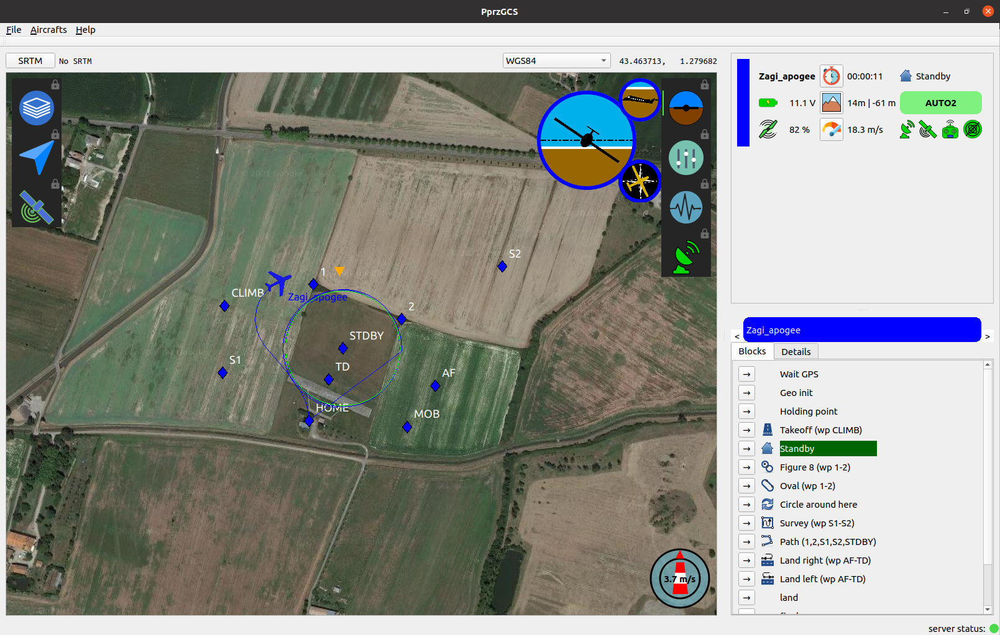

# Ground Control Station for Paparazzi UAV

GCS for [Paparazzi UAV](http://wiki.paparazziuav.org/wiki/Main_Page) in C++/QT5, aiming at replacing the historical GCS in a near future.





## INSTALLATION

### Precompiled binary

Precompilied binary is available only for Ubuntu 20.04 on amd64 architecture (intel 64 bits).

First, install the dependencies:

`sudo apt install libxml2 libzip5 libproj15 libqt5xml5 libqt5network5 libqt5svg5  libqt5texttospeech5 libqt5widgets5 libqt5gui5 libqt5core5a`

Download the `.deb` from latest release at [https://github.com/paparazzi/PprzGCS/releases/latest](https://github.com/Fabien-B/PprzGCS/releases/latest), then install it (adjust the filename as needed) :

`sudo dpkg -i pprzgcs_*.deb`

You can now launch PprzGCS from the paparazzi center via the `Tools` menu.


### Build from sources


#### Ubuntu 20.04 prerequisite

Install the dependencies: 

`sudo apt install extra-cmake-modules libsqlite3-dev libzip-dev qtbase5-dev libqt5svg5-dev libqt5texttospeech5-dev libproj-dev mesa-common-dev libglu1-mesa-dev`


#### Ubuntu 18.04 prerequisite

Install the dependencies:

`sudo apt install extra-cmake-modules libsqlite3-dev libzip-dev mesa-common-dev libglu1-mesa-dev`

__QT5.12.*__

Install [Qt5.12.0 or above](https://www.qt.io/download-open-source).

Setup in your .bashrc the environnement variable Qt5_DIR for cmake to find Qt5:

`export Qt5_DIR="/path/to/Qt/5.12.0/gcc_64/lib/cmake/Qt5"`


__PROJ 6.3.1__

From the PprzGCS root:

_Hint: speed up build by running `export MAKEFLAGS=-j$(nproc)` before building._

```
curl -L https://github.com/OSGeo/PROJ/releases/download/6.3.1/proj-6.3.1.tar.gz | tar -xz -C ext
cmake -S ext/proj-6.3.1/ -B build/ext/proj -DPROJ_TESTS=OFF -DCMAKE_INSTALL_PREFIX=build/install
cmake --build build/ext/proj
cmake --install build/ext/proj
```

### Common instructions


cd to the PprzGCS root, and get the submodules:

`git submodule update --init --recursive`

Build the needed libraries:

`./build.sh libs`

Now you should be able to build the app with:

`./build.sh app`

To be able to run it from the paparazzi center, you need to add the `build/pprzgcs` directory to your *$PATH*. Adapt this command and add it to your .bashrc:

`export PATH="/path/to/PprzGCS/build/pprzgcs:$PATH"`

You should now be able to launch it from the Paparazzi center.

If you want to run it from the terminal, set the `PAPARAZZI_HOME` and the `PAPARAZZI_SRC` environment variables to your paparazzi path, then just run `./build/pprzgcs/pprzgcs`


#### Mac

PprzGCS have been successfully built for Mac, although is not yet officially supported. You are on you own ;-)

More details are given in the [documentation](https://fabien-b.github.io/PprzGCS/)


