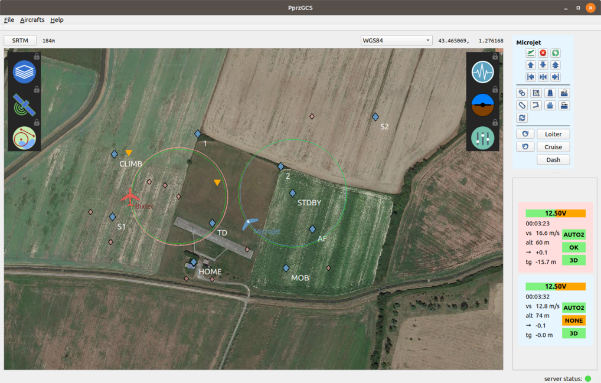
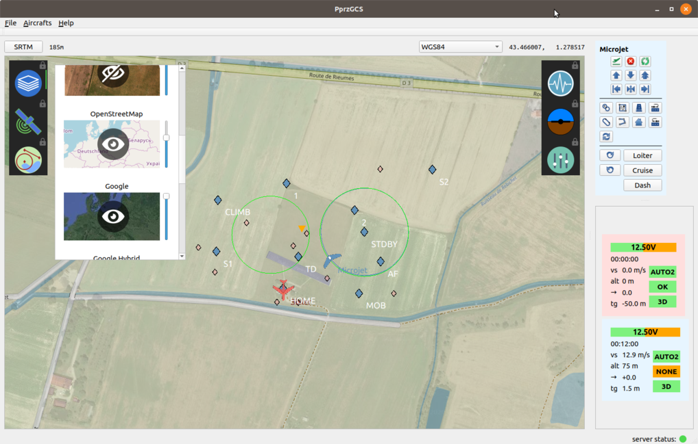
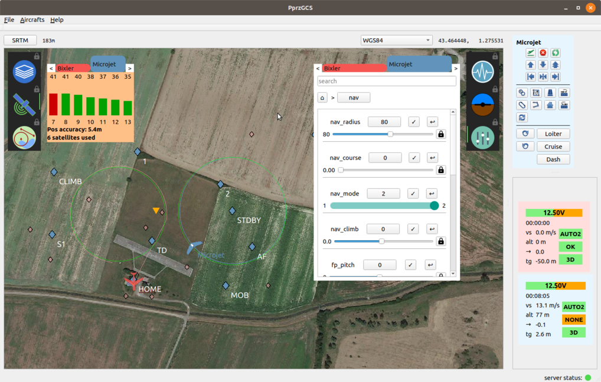

# A new Ground Control Station for Paparazzi UAV

What is Paparazzi? => See the Wiki: http://wiki.paparazziuav.org/wiki/Main_Page

Paparazzi has an historical GCS made with OCaml/GTK2. OCaml is not the most popular language out there, and support for some components of GTK2 has been dropped in last Ubuntu releases. That are th main reasons this GCS started to be develloped in a popular technology choice: C++/QT5.

This GCS aims at replacing the historical GCS in a near future.

## Some screenshots

**Map overlay with transparency**

**Settings and GPS widgets**

**Flight Plan, Strip and "PFD" widgets**

## INSTALLATION

### dependencies
This software depend on Qt5.12 or later, tinyxml2, Ivy and boost libraries. Make sure they are installed on you system.

__WARNING__: Some path are still harcoded, this is work in progress. If you want to contribute on making the build process smoother (or anything else), you are very welcome!

### Fetch submodules:

 `git submodule update --init --recursive`
 
### Build and install the PROJ libraries:

`cd ext/PROJ`

`mkdir build && cd build`

`cmake .. -DBUILD_TESTING=OFF -DCMAKE_INSTALL_PREFIX=./local_install`

`make`

`make install`

### Build the GCS

If you just build PROj, go back to the project root:

`cd ../../..`

`mkdir build && cd build`

`cmake ..`

`make`

Now you can launch it:

`./PprzGCS`

