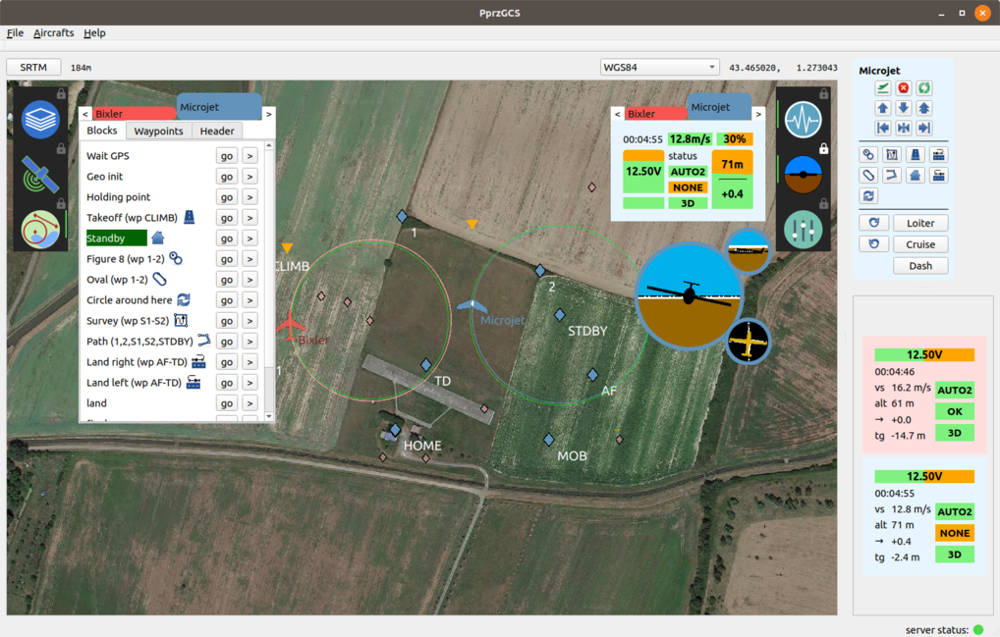

# Ground Control Station for Paparazzi UAV

GCS for [Paparazzi UAV](http://wiki.paparazziuav.org/wiki/Main_Page) in C++/QT5, aiming at replacing the historical GCS in a near future.

## INSTALLATION

Binary is available for Ubuntu 20.04. For other OS, you have to built it from sources.

## Ubuntu 20.04

Get the latest [release](https://github.com/Fabien-B/PprzGCS/releases) and follow the instructions.

## Ubuntu 18.04

#### dependencies

This software depend on Qt5.12 or later, and the following paquets:

* `ivy-c-dev`
* `libboost-system-dev`
* `libsqlite3-dev`
* `libzip-dev`
* `mesa-common-dev libglu1-mesa-dev`

#### Fetch submodules:

 `git submodule update --init --recursive`
 

#### Build the GCS

Set the `Qt5_DIR` environnement variable to the appropriate path. Example:

`export Qt5_DIR="$HOME/Qt/5.12.0/gcc_64/lib/cmake/Qt5"`

Run the build script from the root of the repository:

`./build.sh`

Now you can launch it:

`.build/PprzGCS`

## Mac

PprzGCS can be built for Mac, although is not yet officially supported.

