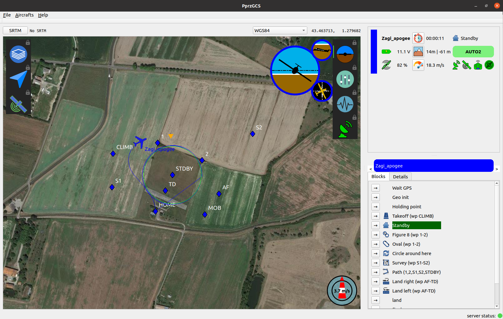

# Ground Control Station for Paparazzi UAV

The new GCS for [Paparazzi UAV](http://wiki.paparazziuav.org/wiki/Main_Page) in C++/Qt6!



It should be straightforward to use it if you are familiar with paparazzi.
Check the [documentation](https://docs.paparazziuav.org/PprzGCS/) for more details.

If you did not installed Paparazzi yet, see the [quick Paparazzi installation guide](https://paparazzi-uav.readthedocs.io/en/latest/quickstart/install.html).


## INSTALLATION

### From Paparazzi PPA

Add the paparazzi PPA:

`sudo add-apt-repository -y ppa:paparazzi-uav/ppa`

And install Pprzgcs!

`sudo apt-get install pprzgcs`

If you don't launch it from the paparazzi center, set the `PAPARAZZI_HOME` and `PAPARAZZI_SRC` environment variables.


### Using the AppImage

If you are not on Ubuntu 22.04 or later, or if you want the latest changes, the best is to use the AppImage.

Get the [latest release](https://github.com/paparazzi/PprzGCS/releases/latest), and give the AppImage the execution rights, then launch it.

To make it work with the paparazzi center, make a symbolic link named `pprzgcs` in one of you `PATH` directories.

The developer version may have new features or bug fixes not landed in releases yet. Open an issue to ask a developer to make a new release.


### Build from sources

On Ubuntu 22.04 or 24.04:

```
git clone --recursive https://github.com/paparazzi/PprzGCS.git
cd PprzGCS
./build.sh
```

`build.sh` first checks what the build needs: it fetches the submodules if they are missing, and
offers to install the missing packages. The program is built in `build/pprzgcs`.

The packages are installed by `install_deps.sh`, which can also be run alone:

| command | packages to |
|---|---|
| `./install_deps.sh` | build and run PprzGCS (`./build.sh`) |
| `./install_deps.sh appimage` | also package the AppImage (`./make_appimage.sh`) |
| `./install_deps.sh deb` | also package the `.deb` (`dpkg-buildpackage`) |
| `./install_deps.sh --check` | only list the missing packages |

Other build options (`./build.sh --help`):
- `./build.sh --debug`: a debug build (warnings are errors).
- With a Qt from the [Qt installer](https://www.qt.io/download-open-source) instead of the system's:
  `CMAKE_PREFIX_PATH=/path/to/Qt/6.x.y/gcc_64 ./build.sh` (the system packages are then not checked).
- On other systems: install the equivalents of the packages listed in `install_deps.sh`, then
  `./build.sh --skip-checks`.

To be able to run it from the paparazzi center, you need to add the `build` directory to your *$PATH*. Adapt this command and add it to your .bashrc:

`export PATH="/path/to/PprzGCS/build:$PATH"`

You should now be able to launch it from the Paparazzi center.

If you want to run it from the terminal, set the `PAPARAZZI_HOME` and the `PAPARAZZI_SRC` environment variables to your paparazzi path, then just run `./build/pprzgcs`


#### gRPC

Add `-DCMAKE_PREFIX_PATH=<path/to/gRPC> -DGRPC=ON` to build with gRPC: `./build.sh -DCMAKE_PREFIX_PATH=<path/to/gRPC> -DGRPC=ON`.

See instructions to buils gRPC from source here: [https://grpc.io/docs/languages/cpp/quickstart/].

#### Mac

PprzGCS have been successfully built for Mac, although is not officially supported. You are on you own ;-)

More details are given in the [documentation](https://docs.paparazziuav.org/PprzGCS/)


## CONTRIBUTING

Project home repository is at [https://github.com/paparazzi/PprzGCS](https://github.com/paparazzi/PprzGCS).

Make pull requests here to contribute.

