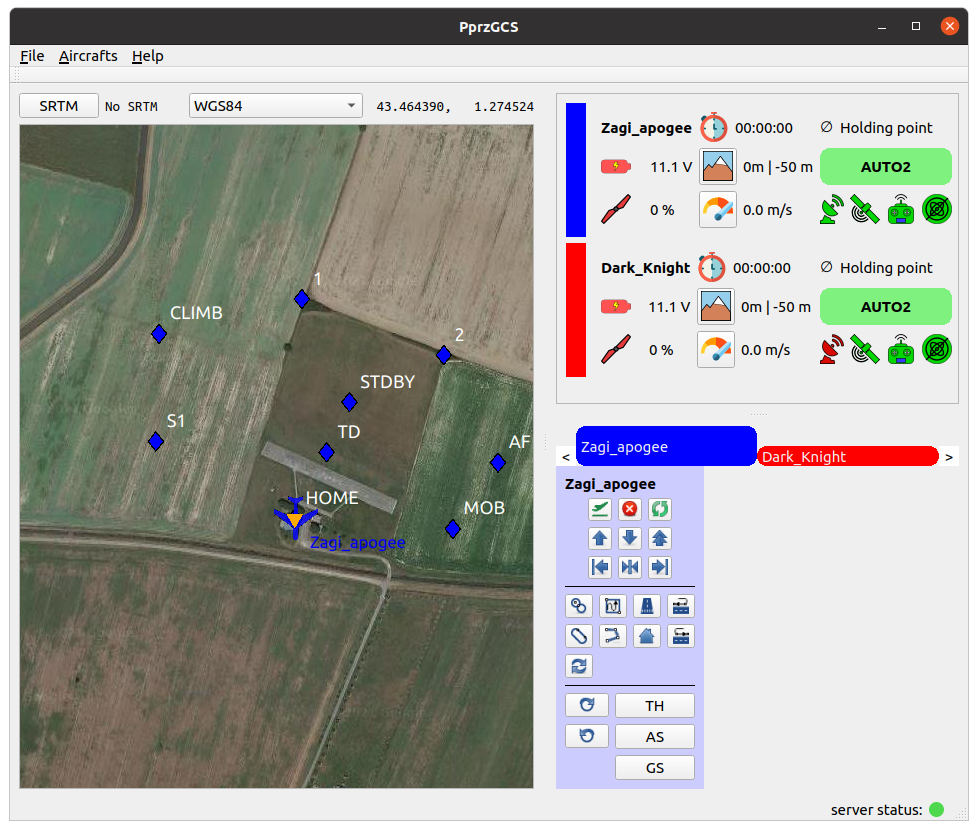

.. developer_guide index_developer

Layout
======

The layout of the GCS can be heavily customized by providing a layout file.

.. admonition:: Where is this file?

    The default layout file is in the app directory (*File -> Open app directory*) and is named ``default_layout.xml``. 
    
    It can be changed in the app settings: *File -> Edit settings -> General -> Layout*.
    
General Layout
--------------

The layout file is an XML file with the root tag being ``layout``.

The widgets can be organized in ``columns`` or ``rows`` recursively. This will create the needed layout with splitters between each widget (so they can be resized).

Widgets are instanciated with the ``widget`` tag. The ``name`` attribute define which widget is instanciated.

.. note::

    ``columns``, ``rows`` and ``widget`` can have a ``size`` attribute. This is a hint that may be overrided by widgets policies.
    

This example of layout features a map on the left, with *strips* and *commands* widgets at its right, organized in rows.

.. code-block:: xml

    <layout width="1000" height="800">
      <columns>
        <widget name="map2d" size="800"/>
        <rows>
            <widget name="strips" container="list"/>
            <widget name="commands" icon="nav.svg"/>
        </rows>
      </columns>
    </layout>

   This is how this layout renders.
   

Containers
----------

Some widgets such as the map handle all aircrafts at once, but some other only handle one aircraft.
They are then instanciated for each aircrafts, and placed together in a *container*.
This is configured by the ``container`` attribute, which can take two values:

+ **list** : This place the widget instances in a vertical list, with a color rectangle next to the corresponding widget.
+ **stack** : this place the widget instances in a "tab like" fashion. This is the default choice.

You can see how it renders on the example above.

Configure
---------

Some widgets can have a ``configure`` tag. The syntax of this tag is widget dependant.

Map
___

The ``map2d`` widget features two columns at the left and right where buttons can be placed. These buttons open a widget next to it, over the map.

The ``configure`` node must contains two children: ``columnLeft`` and ``columnRight``.
Those nodes contains ``widget`` nodes, with an additionnal attribute ``icon`` which specify the icon of the button.

.. note::
	
	Icons must be in the ``pictures`` directory of the app or user directory.

An example of *configure* node for this widget:

.. code-block:: xml

	<configure>
		<columnLeft>
		    <widget name="layers" icon="map_layers_normal.svg"/>
		    <widget name="commands" icon="nav.svg"/>
		    <widget name="gps_classic_viewer" icon="gps.svg"/>
		</columnLeft>
		<columnRight>
		    <widget name="PFD" icon="pfd.svg"/>
		    <widget name="settings" icon="settings.svg"/>
		    <widget name="flight_planV2" icon="flight_plan.svg"/>
		</columnRight>
	</configure>

.. figure:: map2d_configure.png
   :alt: map2d configure rendering

   Configuration rendering, with the PFD widget opened

By default, opening a widget hide the other widgets in the same column. Widgets can be *locked* by clicking on the lock icon, at the top right of each button.

.. note::

	Widgets in the map can also be configured!

.. _layout_plotter:

Plotter
_______

The ``plotter`` widget can be configured with the needed plots at startup.

The ``configure`` node contains ``plot`` nodes, with the mandatory attribute ``name`` describing the data to be plotted.

The name is contructed as follow: ``<class>:<message>:<field>``.

+ **class**: message class (*ground* or *telemetry*).
+ **message**: message name
+ **field**: name of the field to be plotted

Optionnal attributes ``min`` and ``max`` can be added to configure the scale of the plot.

.. code-block:: xml

	<configure>
		<plot name="ground:FLIGHT_PARAM:roll"/>
		<plot name="ground:FLIGHT_PARAM:alt" min="0" max ="500"/>
		<plot name="ground:FLIGHT_PARAM:climb" min="-3" max ="3"/>
	</configure>
	

